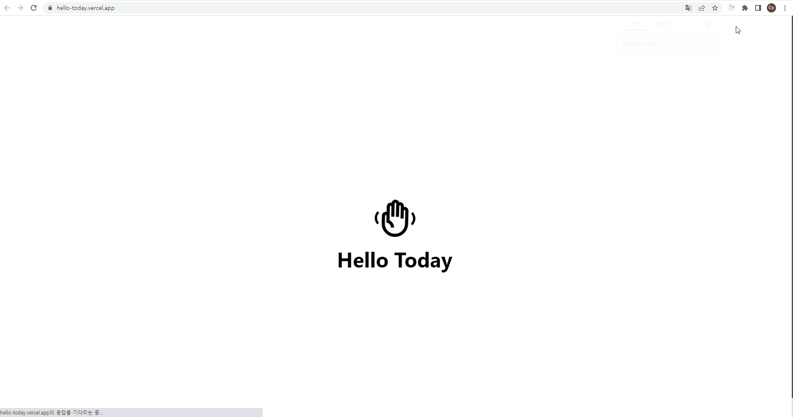

# Hello Today

   
    Notion 오픈 API를 이용한 Todo App
   

목차

## 프로젝트 소개

  notion의 오픈 API를 사용하여 DB 사용 없이 TODO APP 구현 &
  Next.js의 SSR 방식을 이용하여 구현

- next.js의 동작 원리 파악
- 오픈 API 사용 연습

  

 

## 기술 스택

| JavaScript | NextJS  |  React   |  NotionAPI   |
| :--------: | :-----: | :------: | :----------: |
|   ![js]    | ![next] | ![react] | ![notionapi] |

 

## 구현 기능

### Next JS를 활용한 프로젝트 빌드

### Notion 오픈 API를 이용하여 CRUD가 가능한 TODO LIST

### StyledComponent 를 이용한 UI 디자인

 

## 배운 점 & 아쉬운 점

- next js 사용 : react를 공부했으니 가벼운 마음으로 시작했는데 생 독학이라 돌아돌아 고생한 부분이 없지 않아 있는듯 하다 :(
  사실 react를 제대로 공부했다면 하지 않았을 고생일 수 있어서 얕고 넓게만 공부하려는 마음 좀 버리고
  깊게 완전히 이해한 후에 욕심을 내자 라고 생각하게 되었다...그래도 next js라는 프레임워크를 사용해볼 수 있어 좋았다
- notion API : notion API는 생각보다 간단하고 사용만 잘 하면 정말 활용 가능 범위가 넓은 좋은 API임을 실감했다. response가
  간략하게 넘어오진 않아 그를 처리하는데 작은 지연시간이 발생되는 편은 아쉽지만 사용하기에도 간단하고 편해서 좋은 경험이 되었다.

 

<!-- Stack Icon Refernces -->

[js]: /public/img/javascript.svg
[next]: /public/img/nextjs.svg
[react]: /public/img/react.svg
[notionapi]: /public/img/notion.svg
